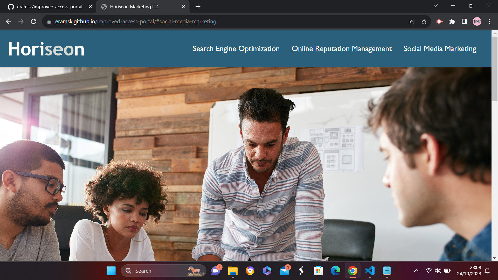

# improved-access-portal

This repository is for horiseon marketing website which has some additional accessibility features for a smooth user friendly experience.
marketing website has 3 main sections:
search engine optimization, online reputation management, social media marketing.
it has a navigation bar which links to these 3 sections.
there is also a sidebar which has some information about lead generation, brand awareness, cost management.
it also has a footer with company details.

# semantic html elements used are:
header
nav
section
aside 
footer 

# Changes made to img src tag:
added an alt attribute for alternate text for images. 
added title attribute to display image related text when user hovers over the image.

# checked all links are working:
search engine optimization is linked properly.

# screenshots of the website:

# repository name: improved-access-portal
# github link: https://eramsk.github.io/improved-access-portal/